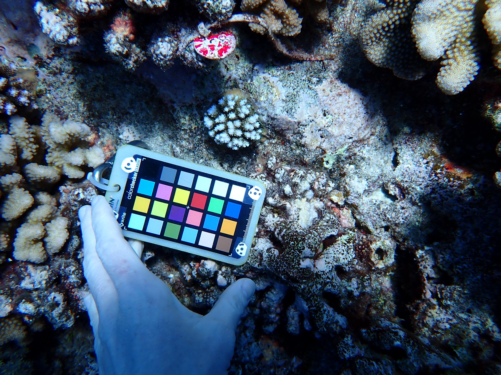

# Thesis Charlotte

Contains data to correlate chlorophyll a data with the pigmentation data

## Content

### Lab

-   [Protocol](physio/protocol/protocol.md) chlorophyll extraction and Symbiodiniaceae density

### Stats

-   [Overview table](https://docs.google.com/spreadsheets/d/1yCTnICWn2zVF5pQH5ARNhXM3eCZ1DsY1htO202Khowk/edit#gid=0) of samples.
-   [Calculation of chlorophyll values and normalisation per surface area](physio/scripts/physio_analysis.qmd) using a set of [functions](physio/scripts/functions.R)
-   A typo in the data export of the photometer is corrected with a [short script](physio/scripts/2024_04_20_clean_typo.R)
